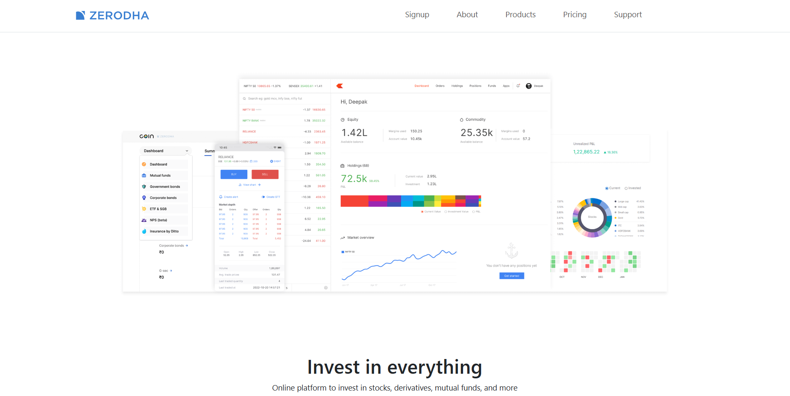
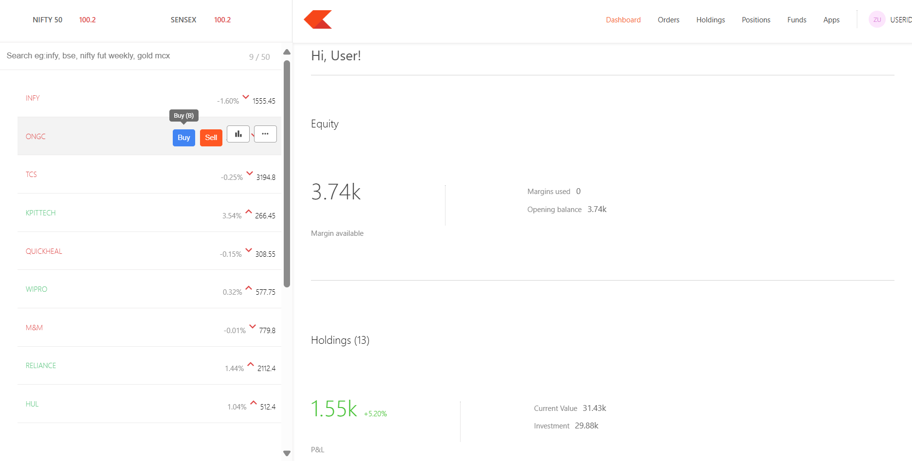
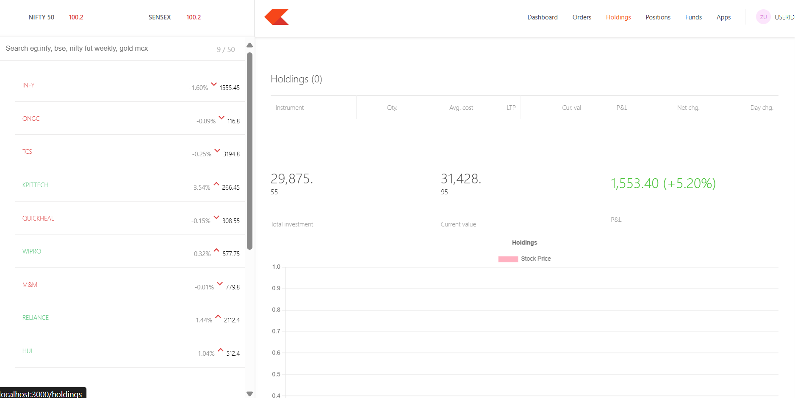

# 📈 Stock Trading Platform

A full-stack stock trading platform showcasing stock charts, trades, and portfolio management.  
This project includes:

- **Frontend** (React.js) – UI for users to view stock data and manage trades.
- **Dashboard** – Stock charts, holdings, and analytics.
- **Backend** (Node.js/Express + MongoDB) – API for handling trades, positions, and portfolio data.

---

## 🚀 Features
- 📊 Live stock charts
- 📝 Trade management (buy/sell)
- 💼 Portfolio tracking (holdings & positions)
- 🔒 Backend APIs for data handling
- 🎨 Modern React dashboard

---

## 🛠️ Tech Stack
- **Frontend**: React, React Router, Chart.js (or Recharts)
- **Backend**: Node.js, Express.js, MongoDB
- **Other**: REST APIs, Git/GitHub

---

## 📂 Project Structure

stock-trading-platform/
├── backend/        # Express + MongoDB backend APIs
├── dashboard/      # React dashboard with charts
├── frontend/       # React frontend (user interface)
├── assets/         # Screenshots & images
├── .gitignore      # Git ignore file
├── README.md       # Project documentation

## 📸 Screenshots

### 🏠 Homepage

### 📊 Dashboard

### 💰 Holdings

